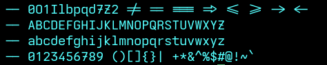

# Cedarva

A custom [Iosevka](https://github.com/be5invis/Iosevka) build aiming for a look somewhere between [Berkeley Mono](https://berkeleygraphics.com/typefaces/berkeley-mono/) and [Maple Mono](https://github.com/subframe7536/maple-font)/[Cascadia Code](https://github.com/microsoft/cascadia-code).

The build configuration is partially based on [Ioskeley](https://github.com/ahatem/IoskeleyMono), customized to my preferences:

- Rounder letterforms and softer curves
- Slightly heavier stroke weight across all weights
- Visually distinct `d`, `b`, `p`, `q` (each letter has a unique shape)
- Slashed `0`, `7`, `Z`

Includes both **Cedarva Mono** (monospaced, with condensed/semi-condensed widths) and **Cedarva Proportional** variants, in TTF and WOFF2 formats.

## License

Licensed under the [SIL Open Font License, Version 1.1](LICENSE).
